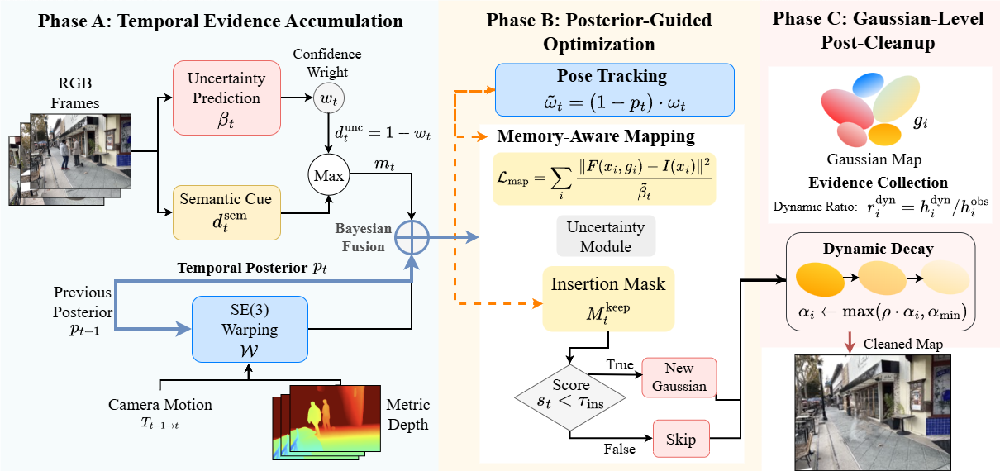

<div align="center">
  <h1>TEG-SLAM: Temporal Evidence Guided Monocular Gaussian SLAM via Memory-Aware Uncertainty Filtering</h1>
  <p>
    <strong>Qixin Xiao</strong> ·
    <strong>Sean Lin</strong> ·
    <strong>Wenjun Cheng</strong> ·
    <strong>Kyle Kai Shuo Chang</strong>
  </p>
  <p><strong>University of Michigan, Ann Arbor</strong></p>
  <p>
    Built on top of <a href="https://github.com/GradientSpaces/WildGS-SLAM">WildGS-SLAM</a>
  </p>
</div>

<p align="center">
  
</p>

<p align="center">
  TEG-SLAM extends monocular Gaussian SLAM with a memory-aware temporal posterior that accumulates evidence across frames, guides tracking and mapping with that posterior, and performs Gaussian-level post-cleanup to suppress persistent ghosting in dynamic scenes.
</p>

## Overview

Monocular Gaussian SLAM works well in many scenes, but dynamic distractors remain a major failure mode. A single-frame uncertainty estimate is fundamentally memoryless: once a moving object slows down, pauses, or reappears after occlusion, the current frame can look static again and dynamic content may leak into the map.

TEG-SLAM addresses this limitation with a temporal evidence pipeline that:

1. propagates a posterior of dynamic evidence across time with SE(3)-consistent warping,
2. fuses the propagated prior with current-frame uncertainty and semantic cues in log-odds space,
3. reuses the resulting temporal posterior during pose tracking, memory-aware mapping, and Gaussian insertion,
4. performs Gaussian-level post-cleanup through evidence collection and opacity decay.

The current repository contains the report-ready `v6` configuration used for our experiments, together with scripts for benchmark reproduction and artifact-focused analysis on `iphone_wandering`.

## Repository Highlights

- `src/utils/dyn_uncertainty/temporal_fusion.py`: temporal posterior propagation and fusion utilities.
- `src/depth_video.py`: posterior-guided tracking and person-prior integration.
- `src/mapper.py`: memory-aware mapping, insertion masks, and Gaussian-level cleanup.
- `scripts_run/run_wild_slam_mocap_v6_sequence.sh`: one-command reproduction for a single Wild-SLAM MoCap sequence.
- `scripts_run/run_wild_slam_mocap_v6_all.sh`: full 10-sequence MoCap batch plus aggregated report generation.

## Installation

Clone the repository with submodules:

```bash
git clone --recursive https://github.com/chloeqxq/TEG-SLAM.git
cd TEG-SLAM
```

Create the environment. The helper scripts default to the environment name `wildgs-slam`.

```bash
conda create --name wildgs-slam python=3.10
conda activate wildgs-slam
```

Install CUDA 11.8 and the core PyTorch stack:

```bash
pip install numpy==1.26.3
conda install --channel "nvidia/label/cuda-11.8.0" cuda-toolkit
pip install torch==2.1.0 torchvision==0.16.0 torchaudio==2.1.0 --index-url https://download.pytorch.org/whl/cu118
pip install torch-scatter -f https://pytorch-geometric.com/whl/torch-2.1.0+cu118.html
pip install -U xformers==0.0.22.post7+cu118 --index-url https://download.pytorch.org/whl/cu118
```

Pin `setuptools` before editable installs:

```bash
pip install setuptools==78.1.1
```

Install the local CUDA extensions and project dependencies:

```bash
python -m pip install -e thirdparty/lietorch/
python -m pip install -e thirdparty/diff-gaussian-rasterization-w-pose/
python -m pip install -e thirdparty/simple-knn/
python -m pip install -e .
python -m pip install -r requirements.txt
```

Install `mmcv-full` for the metric depth estimator:

```bash
pip install mmcv-full -f https://download.openmmlab.com/mmcv/dist/cu118/torch2.1.0/index.html
```

Download the pretrained DROID-SLAM weights and place them in `pretrained/droid.pth`:

```bash
mkdir -p pretrained
# Download:
# https://drive.google.com/file/d/1PpqVt1H4maBa_GbPJp4NwxRsd9jk-elh/view?usp=sharing
```

Verify the installation:

```bash
python -c "import torch; import lietorch; import simple_knn; import diff_gaussian_rasterization; print(torch.cuda.is_available())"
```

## Quick Start

### 1. Crowd demo on Wild-SLAM MoCap

Download the demo sequence:

```bash
bash scripts_downloading/download_demo_data.sh
```

Run the report configuration of TEG-SLAM on the `crowd` sequence:

```bash
bash scripts_run/run_wild_slam_mocap_v6_sequence.sh crowd --profile report
```

This wrapper will:

- generate a temporary `v6` config with temporal posterior, person-aware insertion gating, and Gaussian-level cleanup enabled,
- run SLAM,
- evaluate NVS automatically,
- save outputs to `output/Wild_SLAM_Mocap_report_v6/Crowd_v6_report`.

### 2. Real-world `iphone_wandering` stress test

Download the Wild-SLAM iPhone dataset:

```bash
bash scripts_downloading/download_wild_slam_iphone.sh
```

Run the `v6` TEG-SLAM config:

```bash
python run.py ./configs/Custom/wandering_temporal_proposal_v6.yaml
```

This setup is the artifact-focused real-world case used in the report to study persistent human ghosting and post-cleanup behavior.

If you hit CUDA out-of-memory, reduce the rendering resolution in the selected config, for example:

```yaml
cam:
  H_out: 240
  W_out: 400
```

## Reproducing the Report

### Wild-SLAM MoCap benchmark

Download the full 10 dynamic sequences:

```bash
bash scripts_downloading/download_wild_slam_mocap_scene1.sh
bash scripts_downloading/download_wild_slam_mocap_scene2.sh
```

Run all `v6` benchmark sequences and build the aggregated report package:

```bash
bash scripts_run/run_wild_slam_mocap_v6_all.sh --profile report
```

Useful options:

- `--skip-existing`: reuse finished sequence outputs.
- `--skip-report`: run the SLAM jobs without rebuilding the final summary package.
- `--max-frames N`: smoke-test a shortened run.
- `--profile conservative`: use the more conservative temporal thresholds.

Important outputs:

- per-sequence SLAM and NVS results: `output/Wild_SLAM_Mocap_report_v6/<Scene>_v6_report`
- aggregated report: `output/report_v6_full/report.md`
- report tables and summary metrics: `output/report_v6_full/summary.json`

### Single-sequence reproduction

To run one sequence only:

```bash
bash scripts_run/run_wild_slam_mocap_v6_sequence.sh person --profile report
```

Supported sequence keys are:

```text
anymal1 anymal2 ball crowd person racket stones table1 table2 umbrella
```

## Key Temporal Parameters

The report-ready configs enable the following controls under `mapping.uncertainty_params.temporal_params`:

| Parameter | Role |
| --- | --- |
| `tracking_use_temporal_posterior` | Uses the propagated posterior in tracking-time BA weighting. |
| `mapping_use_temporal_posterior` | Reuses the temporal posterior during mapping-time uncertainty filtering. |
| `fusion_mode: log_odds` | Fuses propagated and current dynamic evidence in Bayesian-style log-odds space. |
| `person_prior_activate` | Adds a semantic person prior to strengthen dynamic detection for people. |
| `insertion_mask_activate` | Prevents likely dynamic regions from inserting new Gaussians. |
| `post_cleanup_opacity_decay_activate` | Applies Gaussian-level evidence collection and opacity decay after the run. |

Useful starting configs:

- `configs/Custom/wandering_temporal_proposal_v6.yaml`
- `configs/Custom/crowd_temporal_proposal_v6_report.yaml`
- `configs/Custom/person_temporal_proposal_v6_report.yaml`
- `configs/Custom/custom_template.yaml`

## Running on Your Own Data

Organize RGB frames as:

```text
your_sequence/
  rgb/
    frame_00000.png
    frame_00001.png
    ...
```

Then:

1. copy `configs/Custom/custom_template.yaml`,
2. set `scene`, `data.input_folder`, and camera intrinsics,
3. enable or tune the temporal parameters if you want the full TEG-SLAM behavior,
4. run:

```bash
python run.py /path/to/your_config.yaml
```

## Results Snapshot

The current `v6` report package supports a focused claim: TEG-SLAM is strongest on human-dynamic scenes and on the real-world ghosting failure case `iphone_wandering`. It is not yet a uniform improvement across the full 10-sequence MoCap benchmark, so we report the most defensible results directly.

| Setting | Metric | WildGS-SLAM paper | TEG-SLAM v6 |
| --- | --- | ---: | ---: |
| `Crowd` | ATE (cm) ↓ | 0.300 | 0.273 |
| `Crowd` | PSNR ↑ | 21.280 | 21.383 |
| `Person` | ATE (cm) ↓ | 0.800 | 0.767 |
| `Person` | PSNR ↑ | 20.310 | 20.618 |
| `iphone_wandering` | Mean BG PSNR ↑ | - | 18.410 |
| `iphone_wandering` | Mean BG MAE ↓ | - | 19.183 |
| `iphone_wandering` | Tail BG PSNR ↑ | - | 18.118 |
| `iphone_wandering` | Tail BG MAE ↓ | - | 20.521 |

Across all 10 Wild-SLAM MoCap sequences, the current `v6` package averages `0.690 cm` ATE versus `0.460 cm` from the paper-reported WildGS-SLAM baseline. In other words, the method should be framed as a targeted improvement for dynamic robustness and artifact suppression rather than a universal replacement.

<p align="center">
  
</p>

## Outputs and Evaluation

After a run, the most useful files are:

- `traj/metrics_full_traj.txt`: full-trajectory ATE summary when ground-truth poses are available.
- `traj/est_poses_full.txt`: estimated camera poses in TUM format.
- `nvs/final_result.json`: novel view synthesis metrics for Wild-SLAM MoCap sequences.
- `gaussian_insertion_stats.json`: insertion-mask statistics for TEG-SLAM runs.
- `post_cleanup_stats.json`: Gaussian-level cleanup statistics.

You can also summarize trajectory metrics with:

```bash
python scripts_run/summarize_pose_eval.py
```

## Acknowledgement

This codebase builds on several excellent open-source projects, especially [WildGS-SLAM](https://github.com/GradientSpaces/WildGS-SLAM), [MonoGS](https://github.com/muskie82/MonoGS), [DROID-SLAM](https://github.com/princeton-vl/DROID-SLAM), [Splat-SLAM](https://github.com/google-research/Splat-SLAM), [GIORIE-SLAM](https://github.com/zhangganlin/GlORIE-SLAM), [nerf-on-the-go](https://github.com/cvg/nerf-on-the-go), and [Metric3D V2](https://github.com/YvanYin/Metric3D). We thank the original authors for releasing their code.

## Citation

If you use this repository, please cite the accompanying TEG-SLAM report/paper. The README title and author list reflect the current manuscript:

```text
TEG-SLAM: Temporal Evidence Guided Monocular Gaussian SLAM via Memory-Aware Uncertainty Filtering
Qixin Xiao, Sean Lin, Wenjun Cheng, Kyle Kai Shuo Chang
```

## Contact

For questions, please contact [Qixin Xiao](mailto:qxiaocs@umich.edu).
